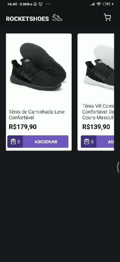

<h1 align="center">
    React Native RocketShoes
</h1>

<h4 align="center">
  NetShoes clone com React Native and Redux.
</h4>

 ## :iphone: Demo:

<div align="center">
  
</div>

<br/>

---

<br/>
## :rocket: Tecnologias

-  React Native
-  Redux
-  Redux-Saga
-  Immer
-  Polished
-  styled-components
-  json-server

---

## :information_source: Como Rodar

- Para rodar essa aplicação, você precisará ter um [ambiente de desenvolvimento React Native](https://reactnative.dev/docs/environment-setup) devidamente configurado, juntamente com o [Node.js](https://nodejs.org/en/) instalado no seu computador.

- No arquivo `api.js`, dentro da pasta `src/services`, altere a baseURL passando seu IP local

```bash
# Clone esse repositório
$ git clone https://github.com/israelfagundes/rocketshoes-mobile

# Navegue até a pasta do repositório
$ cd rocketshoes-mobile

# Instale as dependências
$ yarn

# Inicie o json-server passando seu IP local com a flag --host
$ yarn server --host $SEUIP

# Se estiver no Linux, inicie o bundler antes de continuar
$ yarn start


# Inicie o app no seu smartphone
$ yarn android
```
